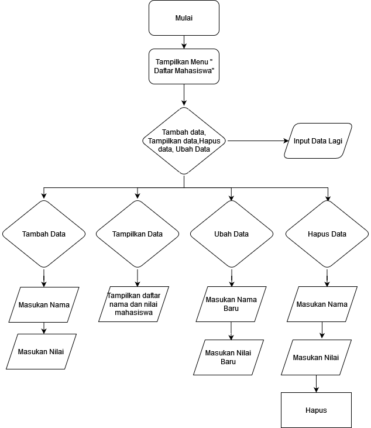
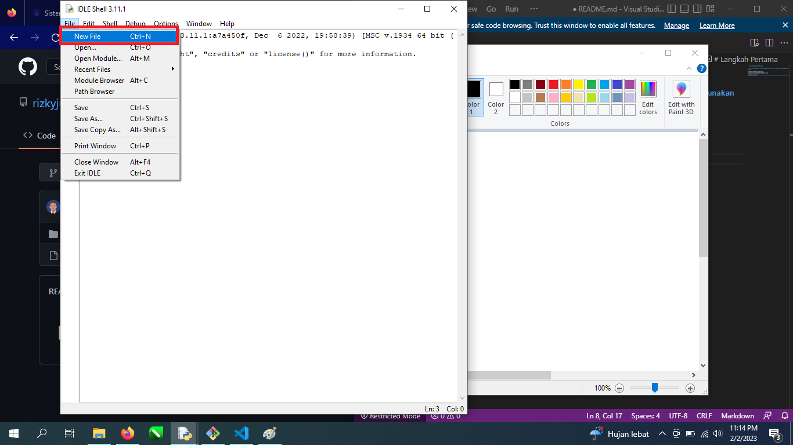
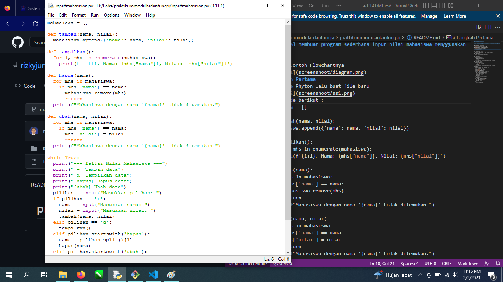
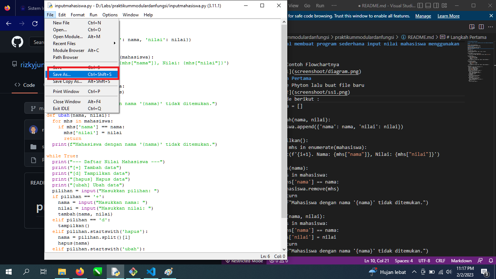
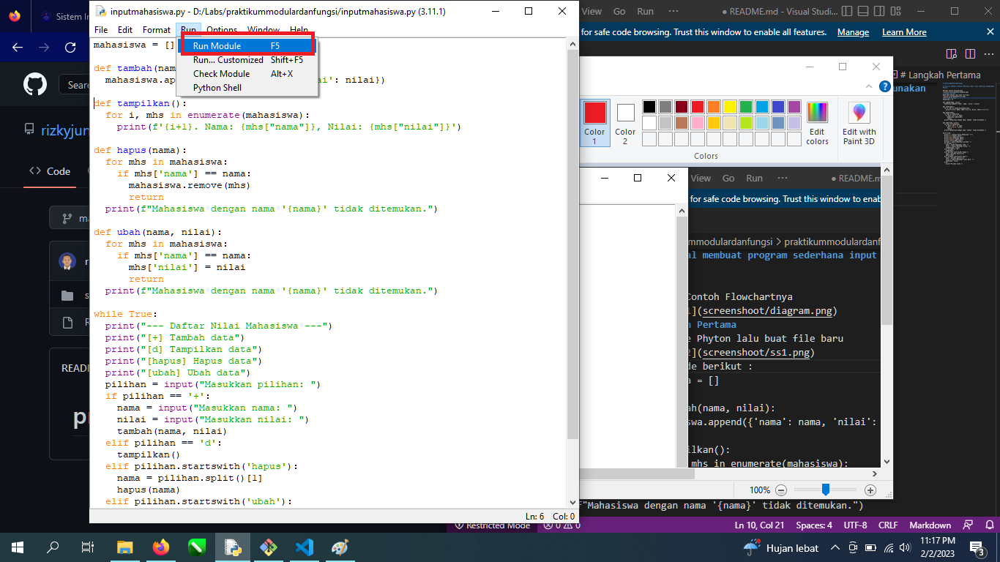
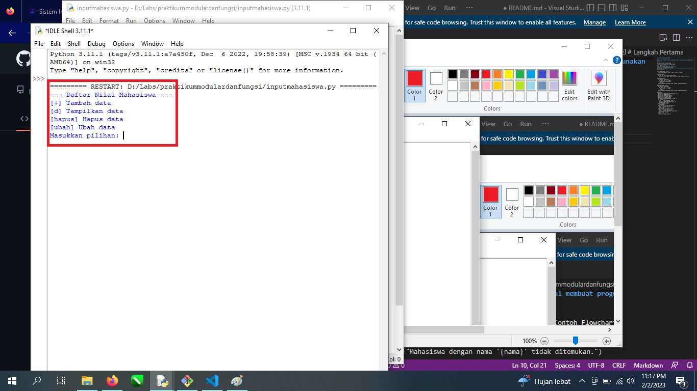
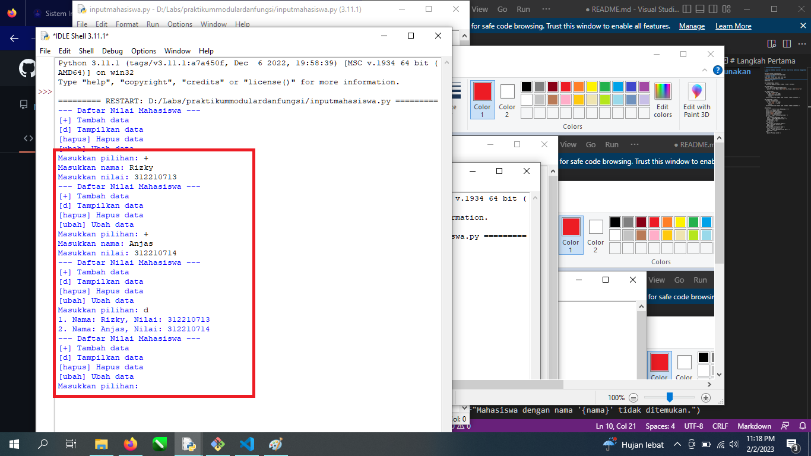

# praktikummodulardanfungsi

# Tutorial membuat program sederhana input nilai mahasiswa menggunakan Phyton

Berikut Contoh Flowchartnya

# Langkah Pertama
Buka Idle Phyton lalu buat file baru

Paste kode berikut :
mahasiswa = []

def tambah(nama, nilai):
  mahasiswa.append({'nama': nama, 'nilai': nilai})

def tampilkan():
  for i, mhs in enumerate(mahasiswa):
    print(f'{i+1}. Nama: {mhs["nama"]}, Nilai: {mhs["nilai"]}')

def hapus(nama):
  for mhs in mahasiswa:
    if mhs['nama'] == nama:
      mahasiswa.remove(mhs)
      return
  print(f"Mahasiswa dengan nama '{nama}' tidak ditemukan.")

def ubah(nama, nilai):
  for mhs in mahasiswa:
    if mhs['nama'] == nama:
      mhs['nilai'] = nilai
      return
  print(f"Mahasiswa dengan nama '{nama}' tidak ditemukan.")

while True:
  print("--- Daftar Nilai Mahasiswa ---")
  print("[+] Tambah data")
  print("[d] Tampilkan data")
  print("[hapus] Hapus data")
  print("[ubah] Ubah data")
  pilihan = input("Masukkan pilihan: ")
  if pilihan == '+':
    nama = input("Masukkan nama: ")
    nilai = input("Masukkan nilai: ")
    tambah(nama, nilai)
  elif pilihan == 'd':
    tampilkan()
  elif pilihan.startswith('hapus'):
    nama = pilihan.split()[1]
    hapus(nama)
  elif pilihan.startswith('ubah'):
    nama = pilihan.split()[1]
    nilai = input("Masukkan nilai baru: ")
    ubah(nama, nilai)
  else:
    print("Pilihan salah.")

Jangan lupa save ke direktori kita

setelah di save klik menu run

maka akan muncul menu

isi menu tersebut

